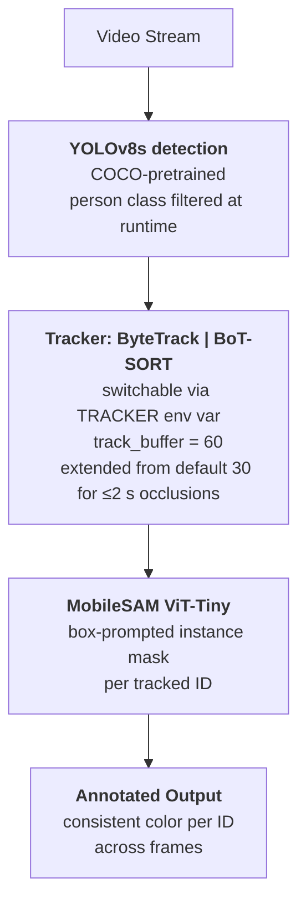
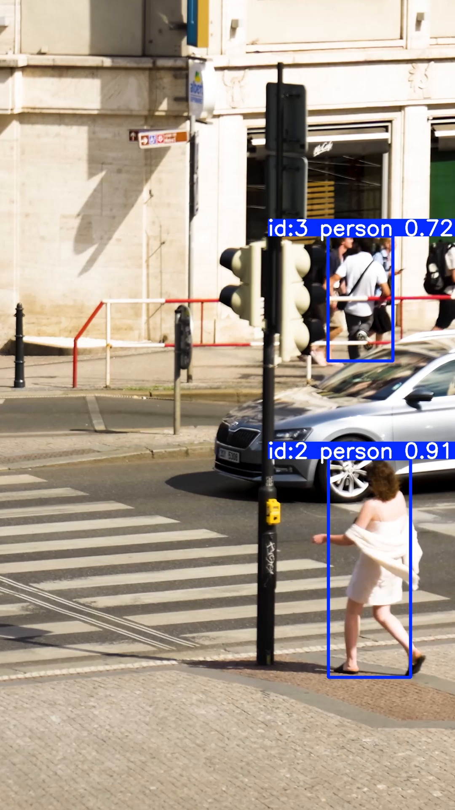

# EdgeTrack

A study of detection → tracking → segmentation as a deployable system, with controlled tracker ablation and CPU edge-deployment profiling.

YOLOv8s for detection, ByteTrack / BoT-SORT for multi-object tracking, MobileSAM for box-prompted instance segmentation, ONNX export and dynamic INT8 quantization for edge characterization, and an automated failure-mining harness to keep the analysis honest.

This project is intentionally scoped to **system integration, ablation, and deployment characterization** rather than custom model training. The goal is to surface the engineering tradeoffs — tracker choice, quantization scheme, occlusion handling — that determine whether a pretrained perception stack is actually production-ready.

---

## Demo

Same 8-second window from both pipelines on a 998-frame outdoor pedestrian video (1080×1920 @ 30 FPS):

| ByteTrack | BoT-SORT |
|---|---|
|  |  |

Each tracked person is overlaid with a MobileSAM-generated instance mask, color-keyed to a persistent track ID. The two demos differ only in tracker module; detector, segmenter, and config are identical.

---

## Architecture



Tracker selection is a one-line env switch so all five experiments — `pipeline`, `validate`, `export`, `benchmark`, `failure_miner` — share a single codebase.

---

## Results

### 1. Detection accuracy — COCO128 validation

| Class | Precision | Recall | mAP@0.5 | mAP@0.5:0.95 |
|---|---|---|---|---|
| **All 80 classes** | 0.788 | 0.668 | **0.759** | **0.586** |
| **Person (primary)** | 0.912 | 0.685 | **0.825** | **0.618** |

The runtime pipeline filters detections to the person class for downstream tracking and segmentation; COCO128 validation reports all 80 classes for context, with the person-class row called out separately as the production-relevant figure. These numbers are pretrained YOLOv8s out-of-the-box; the project does not claim to have trained the detector. They are reported as the baseline against which the rest of the system is integrated.

### 2. Tracker ablation — same input, same detector, same buffer

Run identically on the 998-frame demo video. Only the tracker module differs.

| Metric | ByteTrack | BoT-SORT | Δ |
|---|---|---|---|
| Total person detections forwarded to tracker | 3383 | 3391 | ~equal |
| Unique track IDs assigned across video | 31 | **29** | **−6.5%** |
| Avg detections per unique ID *(higher = fewer breakages)* | 109.1 | **116.9** | **+7.1%** |
| Failure frames flagged by heuristic miner | 99 | 101 | +2 (noise) |

**Two findings, both reported truthfully.**

**a) BoT-SORT modestly improves track persistence.** The unique-ID count dropped by two (31 → 29) and average lifetime per ID rose by 7.1% (109.1 → 116.9). Likely mechanism: BoT-SORT adds camera motion compensation via sparse optical flow (`gmc_method: sparseOptFlow`) and refined proximity / appearance matching thresholds. This ablation did not isolate which of those contributions is dominant.

**b) Persistence gain did not translate into fewer mined failures.** The failure heuristic — frames with ≥2 low-confidence detections or ≥1 lost track-ID of lifetime ≥3 — flagged 99 frames for ByteTrack vs 101 for BoT-SORT. The direction is mildly *against* BoT-SORT, but the magnitude (~2%) is within run-to-run noise. The honest read: the failure mode the heuristic catches — full-occlusion track loss and cross-pedestrian ID re-assignment — is exactly the one neither tracker can fix without appearance embeddings, because both run with `with_reid: False` (Ultralytics does not ship a default pedestrian ReID checkpoint).

**Takeaway.** Buffer extension and motion compensation help with short-horizon track maintenance but cannot solve long-horizon re-association. The principled fix is enabling ReID in BoT-SORT with an OSNet-class pedestrian embedding model (`torchreid`), or switching to StrongSORT with embedded ReID. That is the scoped next step, not a vague aspiration.

### 3. Inference throughput — 300 frames at 640×640

| Model | Hardware | FPS | Latency (ms/frame) |
|---|---|---|---|
| YOLOv8s PyTorch FP32 | NVIDIA T4 GPU | **90.9** | 11.0 |
| YOLOv8s ONNX FP32 | CPU (Xeon, edge proxy) | 6.3 | 159.8 |
| YOLOv8s ONNX INT8 (dynamic) | CPU (Xeon, edge proxy) | 1.0 | 996.3 |

The benchmark cross-cuts both runtimes and hardware deliberately — server inference and edge inference are different deployment surfaces, and the resume-friendly "X% speedup" framing would be dishonest here.

**Finding: dynamic INT8 regressed throughput on YOLOv8s.** This is a real and reproducible result, not a misconfiguration.

- Dynamic post-training quantization only quantizes matmul / gemm operators
- YOLOv8s spends most of its compute in the convolutional backbone, not matmul
- The added per-tensor quantize / dequantize overhead therefore exceeds the savings, and CPU FP32 outperforms CPU INT8

**The corollary that matters.** Dynamic quantization is the wrong tool for conv-heavy detectors. The right tool is **static post-training quantization with a representative calibration dataset**, which quantizes conv layers via collected activation statistics and typically achieves 2–4× CPU speedup on detector workloads of this class. This is scoped as the next deployment-side iteration.

The ONNX runs are CPU-bound on Kaggle because `onnxruntime-gpu` did not register its CUDA execution provider in this environment. A clean CPU benchmark on an edge-class chip (Jetson, Coral, Raspberry Pi) is the appropriate next measurement.

---

## Failure analysis

The `failure_miner.py` script flags frames automatically via two heuristics:

- ≥2 detections with confidence below 0.45
- ≥1 track ID present in frame N−1 with prior lifetime ≥3, and missing in frame N

Samples are stored per-tracker in `assets/failures_bytetrack/` and `assets/failures_botsort/`, evenly down-sampled to 8 frames each from the full 99 / 101 sets. The samples are concrete; the modes below are abstracted from manual review.

| # | Mode | Trigger | Root cause | Where it shows up |
|---|---|---|---|---|
| 1 | Cross-pedestrian ID swap | Two persons cross paths with overlapping boxes | Both trackers use IoU + Kalman only (`with_reid: False`); appearance-blind | Crowd scenes |
| 2 | ID re-assignment after vehicle occlusion >2 s | Person fully occluded beyond `track_buffer` window | Track is killed; new detection cannot match a dead track | Street scenes with passing cars |
| 3 | Static-subject ID instability | Standing person briefly overlapped by a moving passer-by | Transient IoU contamination causes match reassignment | Sidewalk loitering scenes |
| 4 | Low confidence on distant / small persons | Far-field, small bounding-box area | Detector confidence drops below threshold | Long-range frames |
| 5 | Motion-blur degradation | Fast lateral motion | Blurred features reduce detector confidence | High-speed actors |
| 6 | NMS suppression in crowd density | Heavily overlapping detections | Non-max suppression removes valid neighbors | Dense pedestrian groups |
| 7 | Scale variance at frame edges | Partial bodies entering / exiting | Detector trained on full-body boxes | Frame boundaries |
| 8 | Lighting transitions | Shadow ↔ sunlight regions | Confidence dip across exposure change | Outdoor mixed-lighting clips |

### Sample failure frames

Same frame index from both pipelines, illustrating that the failures persist across tracker choice when ReID is disabled.

> **Note on reading these:** each screenshot is the frame where the heuristic flagged a failure (a track ID was lost). Tracking failures are inherently temporal — a single frame cannot fully visualize *which* ID was lost or *what* changed. A complete diagnostic artifact would require N−1 / N frame pairs or short clips around each event; that is a planned harness improvement. The frames are included here as anchors into the failure timeline rather than as standalone visual proofs.

| ByteTrack — frame 27 | BoT-SORT — frame 27 |
|---|---|
|  |  |

Full curated set (8 frames each, evenly sampled across the failure timeline) is in `assets/failures_bytetrack/` and `assets/failures_botsort/`.

Modes 1, 2, 3 are the structurally important ones. They are precisely what motivates the ReID roadmap item.

---

## Repository layout

| File | Purpose |
|---|---|
| `pipeline.py` | End-to-end inference — detection → tracking → segmentation. Tracker switched via `TRACKER` env var. Emits `outputs/demo_<tracker>.mp4` plus tracking stats. |
| `validate.py` | COCO128 detector validation. Emits mAP@0.5 and mAP@0.5:0.95 per class. |
| `export.py` | Exports YOLOv8s → ONNX FP32 → ONNX INT8 dynamic. |
| `benchmark.py` | Inference throughput benchmark across PyTorch GPU, ONNX FP32, ONNX INT8. |
| `failure_miner.py` | Heuristic failure-frame extraction, per tracker. |
| `bytetrack.yaml` | ByteTrack config — extended `track_buffer=60`. |
| `botsort.yaml` | BoT-SORT config — extended buffer + `gmc_method: sparseOptFlow`. |
| `assets/` | GIFs + curated failure samples for both trackers. |

---

## Run

```bash
pip install -r requirements.txt
wget https://github.com/ChaoningZhang/MobileSAM/raw/master/weights/mobile_sam.pt
# place input video as input.mp4 in repo root

TRACKER=bytetrack python pipeline.py
TRACKER=botsort   python pipeline.py

python validate.py
python export.py
python benchmark.py

TRACKER=bytetrack python failure_miner.py
TRACKER=botsort   python failure_miner.py
```

Tested on Kaggle T4 GPU with Python 3.12, PyTorch 2.10, Ultralytics 8.4.51.

Demo MP4s and the larger ONNX files are gitignored to keep the repo lean. The GIFs in `assets/` show the same 8-second window from each tracker pipeline. Re-running `pipeline.py` regenerates the MP4s locally.

---

## Scope and limitations

This is a focused system-integration and ablation study. It is explicitly **not**:

- A custom-trained detector — YOLOv8s and MobileSAM are both used as released pretrained checkpoints
- A domain-adapted system — no fine-tuning on a target distribution
- An evaluation against canonical MOT metrics — there is no MOTA / IDF1 number here, because the input video has no published ground-truth annotations. The tracker comparison uses unique-IDs-per-detection as a proxy
- A real edge benchmark — the CPU numbers come from a Kaggle Xeon, not a Jetson / Coral / mobile SoC, and should be read as a relative comparison between FP32 and INT8 on the same machine

What it *is*: a working, reproducible pipeline with honest measurements at every interface, an ablation that surfaces real tracker tradeoffs, and a deployment study that surfaces real quantization tradeoffs.

---

## Roadmap

In rough order of leverage for a downstream production system:

1. **Enable ReID in BoT-SORT** with OSNet pedestrian embeddings from `torchreid`. Direct fix for failure modes 1, 2, 3.
2. **Static post-training quantization** with a representative calibration set. Direct fix for the conv-layer quantization gap revealed in §Results-3.
3. **Fine-tune YOLOv8s** on a CVAT-annotated domain dataset to harden detection at the small-person and motion-blur edges.
4. **MOTA / IDF1 evaluation** on labeled MOT17 sequences for canonical tracker metrics, replacing the unique-IDs proxy.
5. **TensorRT compilation** for Jetson-class edge hardware — the true edge-deployment story.
6. **Multi-class segmentation** extension (vehicles, signage) beyond the person class.

---

## Tech stack

PyTorch · ONNX Runtime · Ultralytics YOLOv8 · ByteTrack · BoT-SORT · MobileSAM (ViT-Tiny) · OpenCV · NumPy